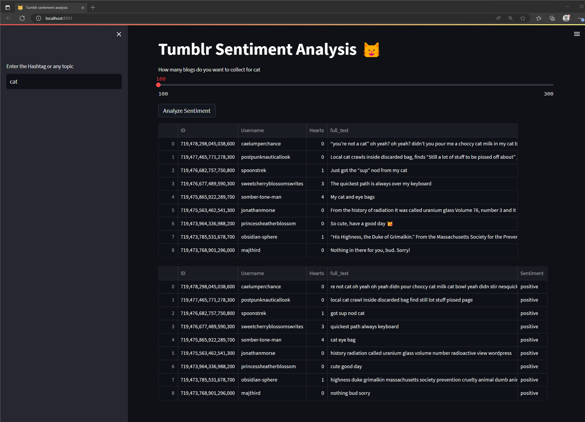

# NLP Sentiment Analysis 📚

This project incorporates various machine learning algorithms for natural language processing (NLP) tasks, including LSTM, SVMs, and Naive Bayes, along with a mini app that performs sentiment analysis on blog posts using the Tumblr API. 📷

 

## Project Overview 🔰
This project focuses on applying machine learning algorithms to NLP tasks and developing a sentiment analysis application using the Tumblr API. The application, built with Streamlit, utilizes essential libraries such as scikit-learn, TensorFlow, and Keras for model training and deployment.

## Data and Embeddings
The project utilizes the Sentiment140 dataset sourced from Kaggle, which consists of 1.6 million tweets. This dataset serves as the foundation for training and evaluating the sentiment analysis models. Additionally, the project utilizes Stanford's GloVe 100-dimensional word embeddings file, glove.6B.100d.txt, obtained from Kaggle. These pre-trained word embeddings enhance the models' understanding of semantic relationships between words.

## Algorithms Used 🎯

### Naive Bayes Classifier (NLP)
The Naive Bayes classifier is a probabilistic algorithm widely used in NLP for text classification tasks. It assumes that the presence or absence of each word in a document is independent of other words, given the class label. Naive Bayes classifiers are commonly used in sentiment analysis, spam detection, and document categorization.

### LSTM (Long Short-Term Memory) (NLP)
LSTM is a type of recurrent neural network (RNN) architecture widely used in NLP tasks. It is designed to handle sequential data and can capture long-term dependencies in text. LSTMs are effective in language modeling, machine translation, sentiment analysis, and named entity recognition. They retain information from previous words to understand context and make predictions.

### SVM (Support Vector Machine) (NLP)
SVM is a machine learning algorithm used for text classification and sentiment analysis in NLP. It finds an optimal hyperplane to separate different classes of text data. SVMs are often used with features derived from text, such as bag-of-words or TF-IDF vectors. They can handle high-dimensional feature spaces and are effective in sentiment analysis, text categorization, and topic classification.

## Evaluation Measures
After training the models, we evaluate their performance using the following measures:

- Accuracy Score: Provides an indication of the overall correctness of the predictive models. Typically, an accuracy score above 90% is considered good.
- ROC-AUC Curve: The Area Under the Curve (AUC) summarizes the model's ability to distinguish between positive and negative classes. A higher AUC indicates better performance in class separation.
- Confusion Matrix with Plot: The confusion matrix compares the actual target values with the predicted values, providing insight into the classification model's performance. A visual plot enhances the understanding of the model's behavior.

By analyzing these evaluation measures, we can assess the effectiveness of the models in accurately classifying the sentiment of the extracted Tumblr blog posts.

## Project Background
Initially, the goal was to perform sentiment analysis on tweets using the Twitter API. However, due to changes in the Twitter API's access and the unavailability of free essential versions, alternative options were explored. Unfortunately, other tools like snscrape, which could scrape tweets, were also inaccessible.

As a result, the focus shifted to using the Tumblr API as a data source, although Tumblr is not an ideal platform for NLP tasks due to its emphasis on multimedia content rather than text. Nevertheless, by leveraging the Tumblr API, it was possible to extract blog posts that contain text and perform sentiment analysis. While the availability of textual data might be limited compared to text-centric platforms like Twitter, the project aimed to explore the possibilities and limitations of applying NLP techniques to Tumblr data.
